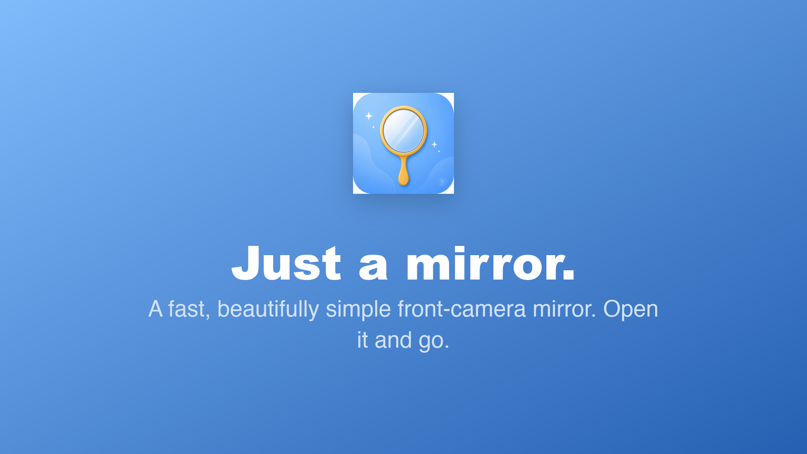
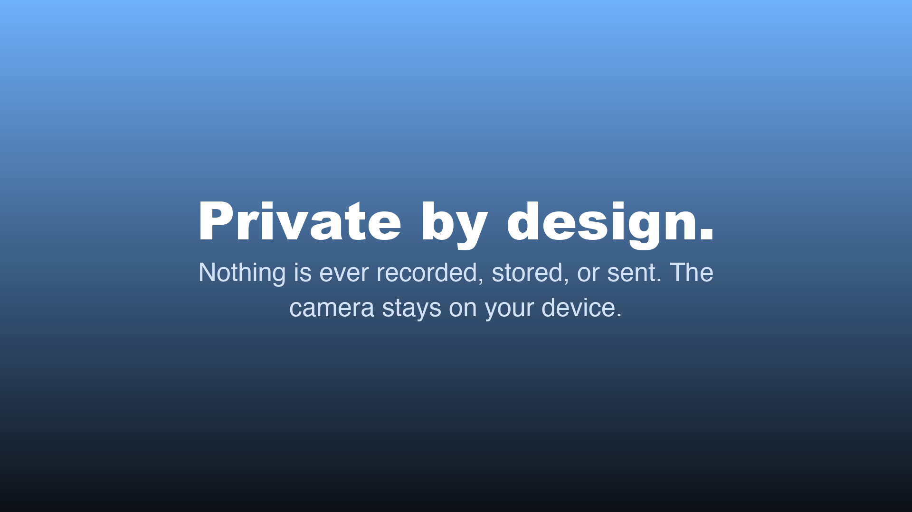

<p align="center">
  
</p>

<h1 align="center">Miroji</h1>

<!-- Build & Deployment Status -->

[](https://github.com/RogerioDoCarmo/mirror_app/actions/workflows/ci.yml)
[](https://github.com/RogerioDoCarmo/mirror_app/actions/workflows/eas-build.yml)

<!-- Code Quality -->

[](https://sonarcloud.io/summary/new_code?id=RogerioDoCarmo_mirror_app)
[](https://sonarcloud.io/summary/new_code?id=RogerioDoCarmo_mirror_app)
[](https://sonarcloud.io/summary/new_code?id=RogerioDoCarmo_mirror_app)
[](https://sonarcloud.io/summary/new_code?id=RogerioDoCarmo_mirror_app)
[](https://sonarcloud.io/summary/new_code?id=RogerioDoCarmo_mirror_app)

<!-- Tech Stack -->

[](https://expo.dev)
[](https://reactnative.dev/)
[](https://www.typescriptlang.org/)
[](https://pnpm.io/)

<!-- Project Info -->

[](https://github.com/RogerioDoCarmo/mirror_app/releases)
[](https://github.com/RogerioDoCarmo/mirror_app/stargazers)
[](https://github.com/RogerioDoCarmo/mirror_app/issues)
[](https://opensource.org/licenses/MIT)
[](https://github.com/RogerioDoCarmo/mirror_app)
[](https://github.com/RogerioDoCarmo/mirror_app/commits/main)

<!-- AI Development Tools -->

[](https://claude.ai/code)
[](https://main--6a2ef191cad660cc8d53a313.chromatic.com)

A React Native application that uses the front-facing camera to display a real-time mirror view.

The app's functionality is intentionally simple. The focus of this project is **engineering quality**: every decision — from folder structure to CI/CD — follows professional-grade standards that reflect how production mobile applications are built and shipped.

---

## Screenshots

<p align="center">
  
  
  
  
</p>

> The complete screenshot sets submitted to both stores (phone, tablet, landscape, and iPad) live in [`store-assets/`](store-assets/).

---

## Motivation

This project serves as a portfolio piece to demonstrate mobile development best practices in a public, auditable codebase. It covers the full lifecycle of a mobile app: local development, automated quality gates, and deployment to both the Apple App Store and Google Play.

---

## Tech Stack

| Layer           | Choice                                             |
| --------------- | -------------------------------------------------- |
| Framework       | [Expo](https://expo.dev) SDK 54 (Managed Workflow) |
| Language        | TypeScript 5.9 — strict mode                       |
| UI              | React Native 0.81 + New Architecture               |
| Camera          | expo-camera v17                                    |
| Package manager | pnpm                                               |

---

## Quality Goals

This project enforces measurable quality standards at every stage of development.

### Test-Driven Development

All production code is written following the **Red → Green → Refactor** cycle:

1. Write a failing test that describes the expected behaviour
2. Write the minimum code needed to make it pass
3. Refactor without breaking the tests

No implementation file exists without a corresponding test file written first.

### Test Coverage

| Layer              | Tool                                   |
| ------------------ | -------------------------------------- |
| Unit & Integration | Jest 29 + React Native Testing Library |
| Property-based     | fast-check                             |
| Mutation           | Stryker                                |
| End-to-End         | Maestro                                |

**Coverage threshold: 80%** across statements, branches, functions, and lines — enforced on every commit via a pre-commit hook. Commits are rejected if coverage drops below this threshold.

**Mutation score threshold: 60% (break) / 80% (target)** — Stryker verifies that tests are actually sensitive to code changes, not just present.

### Property-Based Testing

Unit tests verify specific examples. Property-based tests verify **invariants** — rules that must hold for _any_ input the generator can produce.

[fast-check](https://fast-check.dev) is used alongside Jest to express these invariants. When a property fails, fast-check automatically shrinks the counterexample to the smallest input that reproduces the failure.

**Invariants tested:**

| Component / Hook | Property                                                                          |
| ---------------- | --------------------------------------------------------------------------------- |
| `useCamera`      | `isReady` is always `false` on mount, regardless of permission state              |
| `useCamera`      | `cameraRef.current` is always `null` on mount, regardless of permission state     |
| `useCamera`      | All required return keys are always present, regardless of permission state       |
| `useCamera`      | `permission` always reflects exactly what `useCameraPermissions` returns          |
| `PermissionGate` | `permission=null` always renders the loading indicator and never renders children |
| `PermissionGate` | `granted=true` always renders children for any value of `canAskAgain`             |
| `PermissionGate` | `granted=false` never renders children for any value of `canAskAgain`             |
| `PermissionGate` | `granted=false, canAskAgain=true` always shows the grant button                   |
| `PermissionGate` | `granted=false, canAskAgain=false` always shows the settings message              |

### Static Analysis

| Tool                    | Purpose                                                                                 |
| ----------------------- | --------------------------------------------------------------------------------------- |
| ESLint v9 (flat config) | Linting — typescript-eslint strict rules, react-hooks, testing-library, jest            |
| Prettier                | Consistent formatting across the entire codebase                                        |
| TypeScript strict       | `strict`, `noUncheckedIndexedAccess`, `exactOptionalPropertyTypes`, `noImplicitReturns` |

### Git Hooks

Husky runs the following checks on every `git commit`, blocking the commit if any step fails:

1. **lint-staged** — ESLint + Prettier on staged files only
2. **jest --coverage** — full test suite with coverage threshold enforcement

---

## Architecture

Miroji follows a **Hexagonal (Ports & Adapters)** architecture: source dependencies point
only inward toward a pure domain, and every third-party library (`expo-camera`,
`expo-localization`) is isolated behind a port so it can be swapped by writing a single
adapter. This is a deliberate showcase of SOLID principles, design patterns, and
type-driven domain modeling on an auditable codebase.

**→ See [ARCHITECTURE.md](ARCHITECTURE.md)** for the dependency diagram, the SOLID/pattern
mapping anchored to real files, and an honest account of the trade-offs.

```text
src/
├── core/                     # ← inward-most: no library imports
│   ├── domain/               #   pure types (PermissionState, TranslationKey, SupportedLocale)
│   └── ports/                #   interfaces the app depends on (ICameraPermissionPort, ILocalePort)
├── adapters/                 # the ONLY importers of expo-* libraries
│   ├── expo-camera/          #   ExpoCameraPermissionAdapter implements ICameraPermissionPort
│   └── expo-localization/    #   ExpoLocalizationAdapter implements ILocalePort
├── application/
│   └── providers/            # dependency injection via React Context (CameraProvider, LocaleProvider)
├── components/
│   ├── Button/               # reusable accessible pressable
│   └── PermissionGate/       # loading / denied / blocked / granted permission states
├── hooks/
│   └── useCamera/            # facade over the permission lifecycle + camera ref + ready state
├── screens/
│   └── MirrorScreen/         # front-facing camera rendered in mirror mode
├── i18n/translations/        # en · pt · es · ja string maps (completeness type-enforced)
└── types/                    # shared TypeScript types

.github/workflows/
├── ci.yml                    # lint + typecheck + unit tests + mutation tests (every PR)
├── e2e.yml                   # Maestro flows on iOS simulator and Android emulator
├── firebase-distribution.yml # beta builds to Firebase App Distribution (push to develop)
└── eas-build.yml             # EAS build + store submission (push to main)

.maestro/flows/               # end-to-end test flows (YAML)
```

---

## Branching Strategy — Git Flow

| Branch      | Purpose                                                                                |
| ----------- | -------------------------------------------------------------------------------------- |
| `main`      | Production-ready code. Protected. Only receives merges from `release/*` or `hotfix/*`. |
| `develop`   | Integration branch. All feature branches merge here.                                   |
| `feature/*` | One branch per feature or task, branched from `develop`.                               |
| `release/*` | Branched from `develop` when preparing a store release.                                |
| `hotfix/*`  | Branched from `main` for critical production fixes.                                    |

---

## CI/CD Pipeline

Every pull request into `develop` or `main` triggers the CI workflow:

```text
Lint → Typecheck → Unit/Integration Tests → Mutation Tests
```

Pull requests into `main` additionally trigger E2E tests on both platforms.

Pushing to `main` triggers an EAS production build and automatic submission to both stores.

---

## Getting Started

### Prerequisites

- Node.js 20+
- pnpm 10+
- [Expo CLI](https://docs.expo.dev/get-started/installation/)
- [EAS CLI](https://docs.expo.dev/eas/) (for builds and store submission)
- [Maestro CLI](https://maestro.mobile.dev) (for E2E tests)

### Install

```bash
pnpm install
```

### Run

```bash
pnpm ios       # iOS simulator
pnpm android   # Android emulator
```

---

## Available Scripts

| Script               | Description                                                 |
| -------------------- | ----------------------------------------------------------- |
| `pnpm test`          | Run unit and integration tests                              |
| `pnpm test:coverage` | Run tests with coverage report (enforces 80% threshold)     |
| `pnpm test:watch`    | Run tests in watch mode                                     |
| `pnpm test:e2e`      | Run Maestro E2E flows (requires a running simulator/device) |
| `pnpm mutation`      | Run Stryker mutation tests                                  |
| `pnpm lint`          | Run ESLint                                                  |
| `pnpm lint:fix`      | Run ESLint with auto-fix                                    |
| `pnpm format`        | Run Prettier on all files                                   |
| `pnpm typecheck`     | Run TypeScript type checking                                |

---

## License

[MIT](LICENSE) © 2026 Rogério Ramos Rodrigues do Carmo
